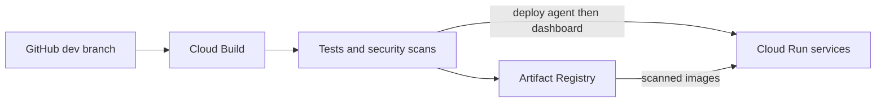
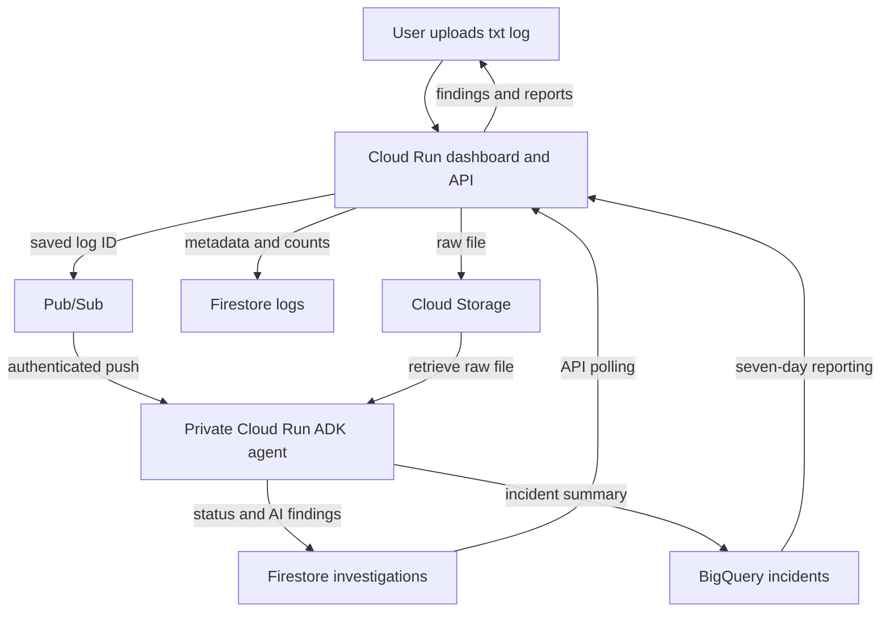
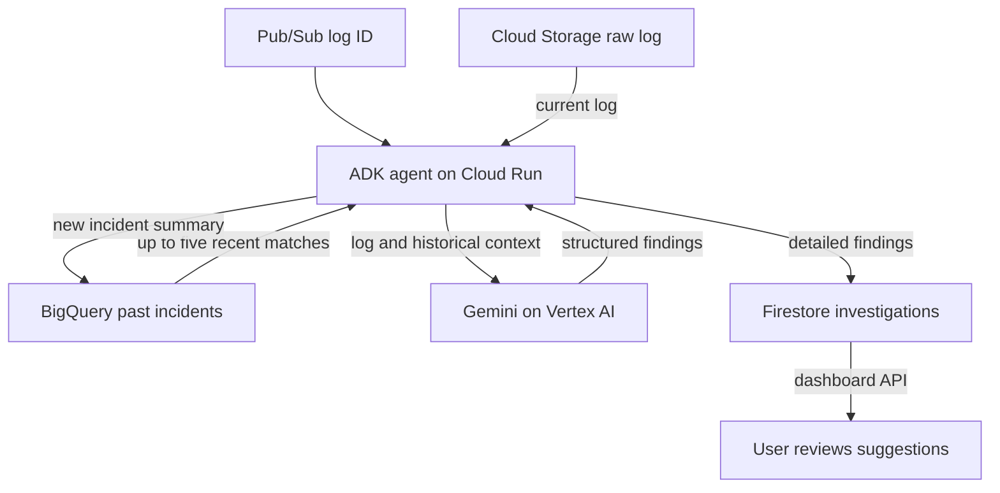
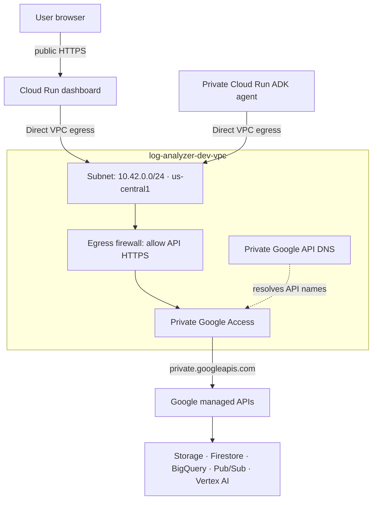

# GCP AI Log Analyzer

A small learning app: upload a synthetic `.txt` log, see ERROR/WARN counts, then review the agent's Gemini findings.

## Incident Time Machine

Home offers **Open a log** and **Try a demo**, followed by your three most recent logs.
Use **Saved logs** to search the full recent library, or **Reports** for seven-day totals.
Within a replay, the service map and timeline stay visible; expand **Event trail** or
**Explore the evidence** when you need more detail. Saved cases support `#case={UUID}`
links, and browser navigation returns to Home, Saved logs or Reports.

Upload UTF-8 `.txt`, `.log` or `.jsonl` files, or open a saved log to reconstruct an incident, scrub its timeline, replay service signals,
and jump to the first recorded fault or an explicit recovery. Filter by request/trace ID,
select a service to inspect its event trail, and follow source references into the numbered
original log. The Evidence panel supports guided timeline questions and keyword search;
the separate AI findings panel shows Gemini's tentative explanations with validated source
line references. Export a case as JSON for a reproducible investigation record.

Three built-in synthetic scenarios demonstrate a retry storm, token expiry and payment
recovery. Previewing a scenario neither saves an upload nor calls Gemini. Choose
**Investigate this scenario** to save it through the normal upload/agent workflow.

`GET /logs/{UUID}/replay` reads the saved file once, includes its original content and
returns a bounded reconstruction plus available findings. It also works for old uploads
and local SQLite storage; it adds no cloud resources or per-frame model calls.
`GET /replay/demo/{retry-storm|token-expiry|payment-recovery}` reconstructs the demo files.

The parser recognizes structured text, JSON Lines and Cloud Logging JSON, including
timestamps, severity, service/logger fields, request IDs and explicit target/upstream fields.
Connections represent recorded call relationships, not proof of successful calls. A shared
trace ID alone does not create an edge. Map colors represent recorded signals, not live health.
The first observed failure is not necessarily the root cause. AI hypotheses remain separate.

When all events have compatible valid timestamps, replay uses chronological order while
retaining original source line numbers. Missing/mixed clocks use source order without an
invented duration. Time-only midnight rollovers are labeled assumptions. Reconstruction scans
up to 12,000 lines, samples to 1,200 events and maps at most 20 services, with visible coverage
notes. Full source remains accessible. AI still sees the first 24,000 source characters;
numbering adds prompt formatting. Existing investigations need no migration.

Playback: **Space** toggles play, **← / →** step through events when focus is outside controls.
The layout supports mobile screens, keyboard controls and reduced-motion preferences.

## Deployment flow



Artifact Registry stores the two container images. Cloud Run runs the dashboard and the private ADK processing service. A merge into `dev` triggers deployment; promotion into `main` does not create a separate production deployment.

## Application data flow



The dashboard saves the file and metadata before queuing its ID. **Cloud Storage** holds the actual log; **Firestore** holds metadata, investigation status and detailed findings. **BigQuery** holds incident summaries for reports and historical context. Reports count completed investigations and refresh at most once per minute.

## AI investigation flow



ADK is the agent framework; Gemini is the model accessed through Vertex AI. Application code retrieves the log and queries recent history before one model call. The model does not run SQL or write cloud resources. If history lookup fails, the investigation continues using the current log. Findings include severity, summary, a tentative cause and suggested next steps.

## VPC network layer



Both Cloud Run services send all outbound traffic through `log-analyzer-dev-subnet`. Private DNS resolves Google API names to `199.36.153.8/30`; a route and firewall allow HTTPS to those addresses and deny other IPv4 egress for the app's network tag. No NAT or VPC connector is used.

The dashboard keeps its public HTTPS entry point. Pub/Sub invokes the agent through its authenticated Cloud Run URL. The VPC controls outbound connectivity; service-account IAM controls data access. Storage, Firestore, BigQuery, Pub/Sub and Vertex AI remain managed services outside the subnet. This configuration does not create a VPC Service Controls perimeter.

## Two pipeline files

| File | Automatic event | What happens |
| --- | --- | --- |
| `cloudbuild-ci.yaml` | Open/update a PR targeting `dev` or `main` | Test and audit both apps; build and scan both containers |
| `cloudbuild.yaml` | Push or merge into `dev` | Same checks, then publish both images and deploy the agent followed by the dashboard |

Cloud Build trigger settings contain the pipeline name, repository event and branch filter. YAML contains ordered `steps`, each with a readable `id`, its builder image `name`, and commands in `args`. Cloud Build uses `steps`; it does not have a `tasks` field. Any failed test, Bandit check, dependency audit or HIGH/CRITICAL image scan stops the pipeline before publication. Each release builds, scans and deploys the same `$BUILD_ID` image tags.

Existing triggers in `ai-log-analyzer-511017`, `us-central1`:

- `log-analyzer-pr-validation`: PR base `^(dev|main)$`, logging-only `log-analyzer-dev-ci` identity.
- `log-analyzer-dev-push`: push branch `^dev$`, `log-analyzer-dev-build` identity with registry/deployment access.

They use Zein's `github-log-analyzer` repository connection. Work on a personal branch, PR into `dev`, then promote reviewed changes to protected `main`. No production trigger exists. A feature-branch push alone does not deploy; the PR runs validation, and its merge into `dev` deploys automatically.

## Existing GCP settings

| Resource | Name |
| --- | --- |
| Project / region | `ai-log-analyzer-511017` / `us-central1` |
| Artifact Registry | `log-analyzer-dev` |
| Cloud Run | `log-analyzer-dev`, `log-analyzer-dev-agent` |
| Raw-log bucket | `ai-log-analyzer-511017-raw-logs-dev` |
| Firestore | `(default)`; `logs` and `investigations` |
| Pub/Sub topic | `log-analyzer-dev-investigations` |
| BigQuery table | `ai-log-analyzer-511017.log_analyzer_dev.incidents` |
| VPC / subnet | `log-analyzer-dev-vpc` / `log-analyzer-dev-subnet` |
| Subnet range / region | `10.42.0.0/24` / `us-central1` |
| Private DNS zone | `log-analyzer-dev-googleapis` |

The YAML `substitutions` configure these resource names, runtime accounts, model, labels and instance limit. Override them on the existing deployment trigger when needed. Attached service accounts authenticate through ADC; no JSON keys or GitHub GCP secrets are needed. Infrastructure and IAM are provisioned separately, not recreated by a release. Both services use Direct VPC egress through `log-analyzer-dev-vpc`, with private Google API access and restricted outbound traffic. IAM controls access to the managed storage and database services.

The dashboard is public; the agent requires IAM authentication. Both services use minimum zero and maximum one instance. The agent also uses concurrency one and a 180-second request deadline. Labels identify the app, development environment, owner and Cloud Build management. Model calls and cloud usage can incur charges; instance limits are not a spending cap.

## App integration

`POST /logs` stores raw content in Storage and metadata in Firestore before publishing `{"log_id":"UUID"}` to the existing topic. Publishing uses the Pub/Sub REST API with attached ADC and a bounded timeout. Raw log text is not placed in the queue.

The agent receives authenticated push at `/pubsub`, reads the raw log, calls Gemini, saves findings to Firestore and loads an incident into BigQuery. `GET /investigations/UUID` exposes status and findings; the dashboard polls while the selected log is running. `POST /investigations/UUID` retries delivery using the saved log ID. Completed or currently processing investigations are not republished through this endpoint. An ambiguous publish can deliver twice; the agent's existing lease/completion checks handle duplicate delivery.

If publication fails, the upload still returns its saved ID with `investigation.status=enqueue_failed`. Retry the investigation, not the upload. Successful publishing records `queued`; the agent then records processing and completion status. Older uploads without dispatch metadata show `waiting`. Automatic Pub/Sub retries/DLQ remain configured by infrastructure. Findings are AI suggestions requiring review. Use synthetic logs without credentials.

## Open the app

Open the public [Incident Desk dashboard](https://log-analyzer-dev-imm5hb2vlq-uc.a.run.app). Upload a synthetic log, then review its progress and AI findings. The separate agent URL remains authenticated and returns 403 to anonymous requests.

## Run locally

```powershell
python -m venv .venv
.\.venv\Scripts\Activate.ps1
pip install -r requirements.txt
python -c "from wsgiref.simple_server import make_server; from app import application; make_server('127.0.0.1', 8080, application).serve_forever()"
python -m unittest discover -s tests -v
```

Local uploads use SQLite and clearly show that AI is disabled. Cloud Run sets `STORAGE_BACKEND=gcp`, `GOOGLE_CLOUD_PROJECT`, `LOG_BUCKET`, `FIRESTORE_DATABASE`, `FIRESTORE_COLLECTION`, and `INVESTIGATION_TOPIC`. Agent tests require its separate dependencies: install `agent_service/requirements.txt` in a separate virtual environment, then run `python -m unittest discover -s tests -v` from `agent_service`.

See [agent details and the smoke test](agent_service/README.md). [Pub/Sub publishing reference](https://docs.cloud.google.com/pubsub/docs/publisher).

## Analytics and private networking

The dashboard includes seven-day BigQuery incident reporting. The ADK agent uses up to five recent matching incidents as context. Both services retain restricted Direct VPC egress and private Google API access. See [the analytics and VPC handoff](infra/Analytics-VPC-handoff.md) for the full data flow and CI/CD variables.

Both `/investigations/{UUID}` and `/logs/{UUID}/investigation` support status lookup and retry for saved uploads.
