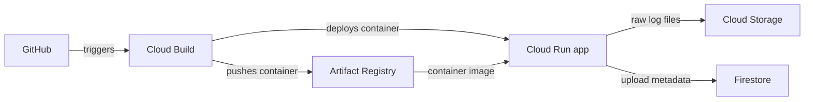

# GCP AI Log Analyzer

A learning app: upload a `.txt` log, count ERROR/WARN lines, and view previous uploads. AI investigation is future work.

## The flow



Infrastructure means the repository, running service, bucket, database, and permissions connecting them. Create these once in GCP; the pipeline updates the app when code changes.

## Two pipeline files

| File | GitHub event | Steps |
| --- | --- | --- |
| `cloudbuild-ci.yaml` | Pull request into `dev` or `main` | Tests and security checks → build → scan image |
| `cloudbuild.yaml` | Push to `dev` | Same checks → push → deploy development app |

These are **Google Cloud Build** YAML files. The pipeline name, GitHub trigger, branch, and build account are configured in **Cloud Build → Triggers**. The YAML defines `steps`: `id` is the readable step name, `name` is the tool's container image, and `args` is its command. Cloud Build has no `tasks` field. Each file starts with its actual trigger name/event and numbered comments explaining the flow. See Google's [build configuration schema](https://docs.cloud.google.com/build/docs/build-config-file-schema).

Opening or updating a PR into `dev`/`main` runs CI automatically. Merging a PR or pushing into `dev` runs CD automatically. A push to your personal branch deploys nothing; an open PR from that branch gets CI checks. Promoting `dev` into `main` gets PR validation; no production deployment trigger exists yet. External PRs need collaborator approval with `/gcbrun`.

A failed step stops the pipeline. Bandit checks source, pip-audit checks dependencies, and Trivy rejects HIGH/CRITICAL image vulnerabilities or detected secrets before publication. The scanned image is the one pushed and deployed. Each deployment uses its own image tag. Cloud Run scales to zero when idle, with one maximum instance per revision configured. Releases deploy directly. This follows Google's [Cloud Build → Cloud Run example](https://docs.cloud.google.com/build/docs/deploying-builds/deploy-cloud-run).

## GCP connection

Project: **`ai-log-analyzer-511017`**. Region: **`us-central1`**. We reuse Zein's resources:

The [scanned deployment build](https://console.cloud.google.com/cloud-build/builds;region=us-central1/3f72cdbc-7983-4f82-bad4-3b3a298b56e8?project=ai-log-analyzer-511017) succeeded on 2026-10-08 using the linked GitHub repository. Tests, Bandit, pip-audit, and Trivy passed before publication. An authenticated synthetic upload verified Cloud Run → Firestore → Storage, an earlier upload persisted, and anonymous access returned HTTP 403. The container uses a small Alpine base because scanning blocked the Debian base's HIGH/CRITICAL findings.

| Resource | Name |
| --- | --- |
| Container repository | `log-analyzer-dev` |
| Cloud Run service | `log-analyzer-dev` |
| Private log bucket | `ai-log-analyzer-511017-raw-logs-dev` |
| Firestore database / collection | `(default)` / `logs` |

| Existing account | Purpose |
| --- | --- |
| `log-analyzer-dev-ci` | PR tests and container build; Logs Writer only |
| `log-analyzer-dev-build` | Releases; Logs Writer, Cloud Run Developer, repository Writer, and Service Account User on the dashboard account |
| `log-analyzer-dev-dashboard` | Running app; existing Firestore access and Object User on the private bucket |

Zein's host connection `github-log-analyzer` is authorized and linked to this repository in `us-central1`. We reuse it and the existing triggers:

| Trigger | Event | Config | Service account |
| --- | --- | --- | --- |
| `log-analyzer-pr-validation` (enabled) | PR into `dev` or `main` | `cloudbuild-ci.yaml` | `log-analyzer-dev-ci` |
| `log-analyzer-dev-push` (enabled after PR #3 merged) | Push to `dev` | `cloudbuild.yaml` | `log-analyzer-dev-build` |

Work on personal feature branches based on `dev`; open a PR into `dev`, then promote reviewed changes from `dev` into protected `main`. No force-pushes. The trigger creator needs Service Account User on the selected account. Require collaborator approval for external PR builds. Merge the corrected YAML into `dev` before enabling its deployment trigger. A production target and trigger are future work.

PR #3 is merged into `dev`, and the development deployment trigger is enabled. Subsequent pushes/merges to `dev` deploy automatically. Pipeline names, events, branches, and build identities live in those GCP trigger settings; each YAML's `steps` contains the ordered commands. Google Cloud Build does not use a `tasks` field.

Before review/merge, you can validate the same release pipeline manually from your checked-out branch:

```powershell
gcloud builds submit https://github.com/zeinhaidara/gcp-ai-log-analyzer.git --git-source-revision=mahmoud/simplify-gcp-pipelines --config=cloudbuild.yaml --region=us-central1 --project=ai-log-analyzer-511017 --service-account=projects/ai-log-analyzer-511017/serviceAccounts/log-analyzer-dev-build@ai-log-analyzer-511017.iam.gserviceaccount.com
```

The app uses its attached service account automatically; no JSON keys or GitHub GCP secrets are needed. CI and release accounts remain separate. The dashboard currently has project-wide Firestore access and bucket Object User; Zein can later limit it to the default database and Object Creator + Viewer, and scope release access to this Cloud Run service after its first deployment.

Deployment settings are the `substitutions` at the bottom of `cloudbuild.yaml`. Override them in a trigger without editing the app: `_REGION`, `_IMAGE`, `_SERVICE`, `_RUNTIME_SERVICE_ACCOUNT`, `_LOG_BUCKET`, `_FIRESTORE_DATABASE`, `_FIRESTORE_COLLECTION`, and `_MAX_INSTANCES`. `_REPOSITORY` supplies the default image path. These are resource settings, not secrets. For example, set `_MAX_INSTANCES=2` in the trigger. Keep future secrets in Secret Manager and grant access only to the runtime account that needs them.

The app is hosted online at [its Cloud Run URL](https://log-analyzer-dev-imm5hb2vlq-uc.a.run.app). It currently requires GCP authentication, so opening that URL in an ordinary browser without an identity token returns 403. Open its [Cloud Run page](https://console.cloud.google.com/run/detail/us-central1/log-analyzer-dev/metrics?project=ai-log-analyzer-511017) to inspect revisions and logs. The local proxy forwards authenticated requests to this online service; it does not run the app locally: `gcloud run services proxy log-analyzer-dev --project=ai-log-analyzer-511017 --region=us-central1 --port=8080`. The signed-in account needs Cloud Run Invoker. Browser sign-in through IAP or public access is a separate access setting. Builds and cloud resources may incur charges.

The Cloud Run service is labeled `app=log-analyzer`, `environment=dev`, `owner=mahmoud`, and `managed-by=cloud-build`. `_LABELS` preserves these values on future deployments and can be overridden in the trigger. Build records also have searchable app/environment/owner tags. Labels identify resources; they do not grant access.

## Run locally

```powershell
python -m venv .venv
.\.venv\Scripts\Activate.ps1
pip install -r requirements.txt
python -c "from wsgiref.simple_server import make_server; from app import application; make_server('127.0.0.1', 8080, application).serve_forever()"
```

Open `http://localhost:8080`. Local uploads use SQLite at `data/logs.db`; Cloud Run uses Storage and Firestore through `storage.py`.

Run tests with `python -m unittest discover -s tests -v`.
