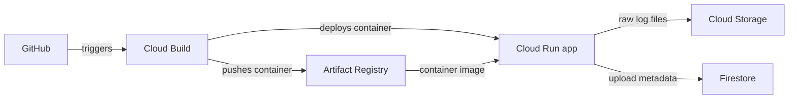

# GCP AI Log Analyzer

A learning app: upload a `.txt` log, count ERROR/WARN lines, and view previous uploads. AI investigation is future work.

## The flow



Infrastructure means the repository, running service, bucket, database, and permissions connecting them. Create these once in GCP; the pipeline updates the app when code changes.

## Two pipeline files

| File | GitHub event | Steps |
| --- | --- | --- |
| `cloudbuild-ci.yaml` | Pull request into `main` | Test → build container |
| `cloudbuild.yaml` | Push to `main` | Test → build → push → deploy |

A failed step stops the pipeline. Each deployment uses its own image tag. Cloud Run scales to zero when idle, with a maximum of one instance configured. Releases deploy directly; there are no custom rollout scripts or automatic rollback checks. This follows Google's [Cloud Build → Cloud Run example](https://docs.cloud.google.com/build/docs/deploying-builds/deploy-cloud-run).

## GCP connection

Project: **`ai-log-analyzer-511017`**. Region: **`us-central1`**. We reuse Zein's resources:

The [manual pipeline run](https://console.cloud.google.com/cloud-build/builds;region=us-central1/b40a64cc-ce7f-463d-ba8c-8e1dd7d9daa4?project=ai-log-analyzer-511017) succeeded on 2026-10-08. An authenticated synthetic upload verified Cloud Run → Firestore → Storage; anonymous access returned HTTP 403. The app is deployed; automatic GitHub triggering is still pending.

| Resource | Name |
| --- | --- |
| Container repository | `log-analyzer-dev` |
| Cloud Run service | `log-analyzer-dev-dashboard` |
| Private log bucket | `ai-log-analyzer-511017-raw-logs-dev` |
| Firestore database / collection | `(default)` / `logs` |

| Existing account | Purpose |
| --- | --- |
| `log-analyzer-dev-ci` | PR tests and container build; Logs Writer only |
| `log-analyzer-dev-build` | Releases; Logs Writer, Cloud Run Developer, repository Writer, and Service Account User on the dashboard account |
| `log-analyzer-dev-dashboard` | Running app; existing Firestore access and Object User on the private bucket |

The GitHub connection attempt failed because the Cloud Build service agent lacks `secretmanager.secrets.create` and `secretmanager.secrets.setIamPolicy`. Your Editor account cannot grant project IAM. Zein/admin must complete the [GitHub host connection](https://docs.cloud.google.com/build/docs/automating-builds/github/connect-repo-github), authorizing only this repository, then create two triggers in `us-central1` with branch pattern `^main$`:

| Trigger | Event | Config | Service account |
| --- | --- | --- | --- |
| `log-analyzer-pr` | Pull request | `cloudbuild-ci.yaml` | `log-analyzer-dev-ci` |
| `log-analyzer-main` | Push | `cloudbuild.yaml` | `log-analyzer-dev-build` |

The trigger creator needs Service Account User on the selected account. Require collaborator approval for external PR builds. Merge this branch through a PR before enabling releases from `main`.

Until the repository is linked, you can run the same release pipeline manually from your checked-out branch:

```powershell
gcloud builds submit https://github.com/zeinhaidara/gcp-ai-log-analyzer.git --git-source-revision=mahmoud/simplify-gcp-pipelines --config=cloudbuild.yaml --region=us-central1 --project=ai-log-analyzer-511017 --service-account=projects/ai-log-analyzer-511017/serviceAccounts/log-analyzer-dev-build@ai-log-analyzer-511017.iam.gserviceaccount.com
```

The app uses its attached service account automatically; no JSON keys or GitHub GCP secrets are needed. CI and release accounts remain separate. The dashboard currently has project-wide Firestore access and bucket Object User; Zein can later limit it to the default database and Object Creator + Viewer, and scope release access to this Cloud Run service after its first deployment.

Deployment settings are the `substitutions` at the bottom of `cloudbuild.yaml`. Override them in a trigger without editing the app: `_REGION`, `_REPOSITORY`, `_SERVICE`, `_RUNTIME_ACCOUNT`, `_LOG_BUCKET`, `_DATABASE`, `_COLLECTION`, and `_MAX_INSTANCES`. These are resource settings, not secrets. For example, set `_MAX_INSTANCES=2` in the trigger. Keep future secrets in Secret Manager and grant access only to the runtime account that needs them.

The deployed app requires GCP authentication. For local access, run `gcloud run services proxy log-analyzer-dev-dashboard --project=ai-log-analyzer-511017 --region=us-central1 --port=8080`, then open `http://localhost:8080`. The signed-in account needs Cloud Run Invoker. Upload a synthetic log and inspect its object in Storage and record in Firestore to see the connections. Builds and cloud resources may incur charges.

## Run locally

```powershell
python -m venv .venv
.\.venv\Scripts\Activate.ps1
pip install -r requirements.txt
python -c "from wsgiref.simple_server import make_server; from app import application; make_server('127.0.0.1', 8080, application).serve_forever()"
```

Open `http://localhost:8080`. Local uploads use SQLite at `data/logs.db`; Cloud Run uses Storage and Firestore through `storage.py`.

Run tests with `python -m unittest discover -s tests -v`.
