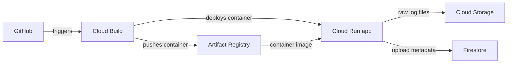

# GCP AI Log Analyzer

A learning app: upload a `.txt` log, count ERROR/WARN lines, and view previous uploads. AI investigation is future work.

## The flow



Infrastructure means the repository, running service, bucket, database, and permissions connecting them. Create these once in GCP; the pipeline updates the app when code changes.

## Two pipeline files

| File | GitHub event | Steps |
| --- | --- | --- |
| `cloudbuild-ci.yaml` | Pull request into `main` | Test → build container |
| `cloudbuild.yaml` | Push to `main` | Test → build → push → deploy |

A failed step stops the pipeline. Each deployment uses its own image tag. Cloud Run scales to zero when idle, with a maximum of one instance configured. Releases deploy directly; there are no custom rollout scripts or automatic rollback checks. This follows Google's [Cloud Build → Cloud Run example](https://docs.cloud.google.com/build/docs/deploying-builds/deploy-cloud-run).

## One-time GCP setup

Project: **`ai-log-analyzer-511017`**. Region: **`us-central1`**. Cloud resources and triggers are **not activated yet**. Your account has Editor; Zein/admin needs to grant the permissions below.

1. Enable Cloud Build, Artifact Registry, Cloud Run, Firestore, Cloud Storage, Cloud Logging, IAM, Secret Manager, and Cloud Resource Manager APIs.
2. Create a Docker Artifact Registry repository named `log-analyzer` in `us-central1`.
3. Create the private bucket `ai-log-analyzer-511017-log-analyzer-raw` in `us-central1`, with uniform bucket access and public access prevention.
4. Create a Firestore Native database named `log-analyzer` in `us-central1`.
5. Create these service accounts and grant their roles:

| Account | Permissions |
| --- | --- |
| `log-analyzer-ci` | Logs Writer |
| `log-analyzer-build` | Logs Writer; Cloud Run Developer; Artifact Registry Writer on the `log-analyzer` repository; Service Account User on `log-analyzer-runtime` |
| `log-analyzer-runtime` | Datastore User scoped to the `log-analyzer` database; Storage Object Creator and Storage Object Viewer on the log bucket |

6. In Cloud Build → Repositories, connect `zeinhaidara/gcp-ai-log-analyzer` through the GitHub App. Create two triggers in `us-central1`, using branch pattern `^main$`:

| Trigger | Event | Config | Service account |
| --- | --- | --- | --- |
| `log-analyzer-pr` | Pull request | `cloudbuild-ci.yaml` | `log-analyzer-ci` |
| `log-analyzer-main` | Push | `cloudbuild.yaml` | `log-analyzer-build` |

The trigger creator needs Service Account User on the selected account. Require collaborator approval for external PR builds. After setup, run the main trigger and watch its four steps in Cloud Build.

The deployed app requires GCP authentication. For local access to the private service, run `gcloud run services proxy log-analyzer --project=ai-log-analyzer-511017 --region=us-central1 --port=8080`, then open `http://localhost:8080`. The signed-in account needs Cloud Run Invoker. Upload a synthetic log and inspect its object in Storage and record in Firestore to see the connections. Builds and cloud resources may incur charges.

## Run locally

```powershell
python -m venv .venv
.\.venv\Scripts\Activate.ps1
pip install -r requirements.txt
python -c "from wsgiref.simple_server import make_server; from app import application; make_server('127.0.0.1', 8080, application).serve_forever()"
```

Open `http://localhost:8080`. Local uploads use SQLite at `data/logs.db`; Cloud Run uses Storage and Firestore through `storage.py`.

Run tests with `python -m unittest discover -s tests -v`.
