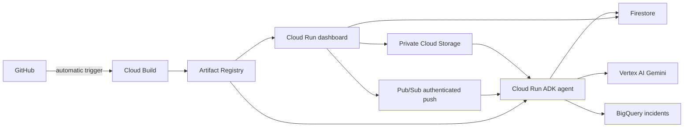

# GCP AI Log Analyzer

A small learning app: upload a synthetic `.txt` log, see ERROR/WARN counts, then review the agent's Gemini findings.



## Two pipeline files

| File | Automatic event | What happens |
| --- | --- | --- |
| `cloudbuild-ci.yaml` | Open/update a PR targeting `dev` or `main` | Test and audit both apps; build and scan both containers |
| `cloudbuild.yaml` | Push or merge into `dev` | Same checks, then publish both images and deploy the agent followed by the dashboard |

Cloud Build trigger settings contain the pipeline name, repository event and branch filter. YAML contains ordered `steps`, each with a readable `id`, its builder image `name`, and commands in `args`. Cloud Build uses `steps`; it does not have a `tasks` field. Any failed test, Bandit check, dependency audit or HIGH/CRITICAL image scan stops the pipeline before publication. Each release builds, scans and deploys the same `$BUILD_ID` image tags.

Existing triggers in `ai-log-analyzer-511017`, `us-central1`:

- `log-analyzer-pr-validation`: PR base `^(dev|main)$`, logging-only `log-analyzer-dev-ci` identity.
- `log-analyzer-dev-push`: push branch `^dev$`, `log-analyzer-dev-build` identity with registry/deployment access.

They use Zein's `github-log-analyzer` repository connection. Work on a personal branch, PR into `dev`, then promote reviewed changes to protected `main`. No production trigger exists. A feature-branch push alone does not deploy; the PR runs validation, and its merge into `dev` deploys automatically.

## Existing GCP settings

| Resource | Name |
| --- | --- |
| Project / region | `ai-log-analyzer-511017` / `us-central1` |
| Artifact Registry | `log-analyzer-dev` |
| Cloud Run | `log-analyzer-dev`, `log-analyzer-dev-agent` |
| Raw-log bucket | `ai-log-analyzer-511017-raw-logs-dev` |
| Firestore | `(default)`; `logs` and `investigations` |
| Pub/Sub topic | `log-analyzer-dev-investigations` |
| BigQuery table | `ai-log-analyzer-511017.log_analyzer_dev.incidents` |

The YAML `substitutions` configure these resource names, runtime accounts, model, labels and instance limit. Override them on the existing deployment trigger when needed. Attached service accounts authenticate through ADC; no JSON keys or GitHub GCP secrets are needed. Infrastructure and IAM are provisioned separately, not recreated by a release. No custom VPC is needed for this managed-service flow.

Both services keep IAM authentication, minimum zero and maximum one instance. The agent also uses concurrency one and a 180-second request deadline. Labels identify the app, development environment, owner and Cloud Build management. Model calls and cloud usage can incur charges; instance limits are not a spending cap.

## App integration

`POST /logs` stores raw content in Storage and metadata in Firestore before publishing `{"log_id":"UUID"}` to the existing topic. Publishing uses the Pub/Sub REST API with attached ADC and a bounded timeout. Raw log text is not placed in the queue.

The agent receives authenticated push at `/pubsub`, reads the raw log, calls Gemini, saves findings to Firestore and loads an incident into BigQuery. `GET /investigations/UUID` exposes status and findings; the dashboard polls while the selected log is running. `POST /investigations/UUID` retries delivery using the saved log ID. Completed or currently processing investigations are not republished through this endpoint. An ambiguous publish can deliver twice; the agent's existing lease/completion checks handle duplicate delivery.

If publication fails, the upload still returns its saved ID with `investigation.status=enqueue_failed`. Retry the investigation, not the upload. Initial status is `waiting` until the agent creates its investigation document. Automatic Pub/Sub retries/DLQ remain configured by infrastructure. Findings are AI suggestions requiring review. Use synthetic logs without credentials.

## Open the app

The dashboard is hosted at [its Cloud Run URL](https://log-analyzer-dev-imm5hb2vlq-uc.a.run.app). IAM currently requires authenticated requests; an ordinary browser without a token returns 403. For authorized testing:

```powershell
gcloud run services proxy log-analyzer-dev --project=ai-log-analyzer-511017 --region=us-central1 --port=8080
```

Open `http://localhost:8080`. This proxy forwards requests to the hosted service. Browser sign-in or public access requires a separate access setting.

## Run locally

```powershell
python -m venv .venv
.\.venv\Scripts\Activate.ps1
pip install -r requirements.txt
python -c "from wsgiref.simple_server import make_server; from app import application; make_server('127.0.0.1', 8080, application).serve_forever()"
python -m unittest discover -s tests -v
```

Local uploads use SQLite and clearly show that AI is disabled. Cloud Run sets `STORAGE_BACKEND=gcp`, `GOOGLE_CLOUD_PROJECT`, `LOG_BUCKET`, `FIRESTORE_DATABASE`, `FIRESTORE_COLLECTION`, and `INVESTIGATION_TOPIC`. Agent tests require its separate dependencies: install `agent_service/requirements.txt` in a separate virtual environment, then run `python -m unittest discover -s tests -v` from `agent_service`.

See [agent details and the smoke test](agent_service/README.md). [Pub/Sub publishing reference](https://docs.cloud.google.com/pubsub/docs/publisher).

## Analytics and private networking

The dashboard includes seven-day BigQuery incident reporting. The ADK agent uses up to five recent matching incidents as context. Both services retain restricted Direct VPC egress and private Google API access. See [the analytics and VPC handoff](infra/Analytics-VPC-handoff.md) for the full data flow and CI/CD variables.

Both `/investigations/{UUID}` and `/logs/{UUID}/investigation` support status lookup and retry for saved uploads.
