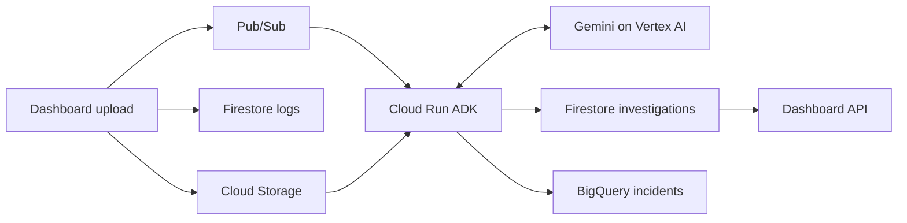

# ADK investigation service

Zein owns this service. Mahmoud owns the dashboard and its CI/CD. Branch workflow: `zein/adk` -> PR to `dev` -> PR to protected `main`.

The service receives authenticated Pub/Sub push requests, retrieves the uploaded raw log from Cloud Storage, runs one ADK/Gemini investigation, persists structured findings in Firestore, and appends a summary to BigQuery using a load job.

Verified on October 8, 2026: the private service is deployed with image tag `zein-adk-1`. Synthetic upload `e91426a5-057f-4a4c-b4bb-cebfd00bb888` completed through Pub/Sub, Gemini (`gemini-3.1-flash-lite`), Firestore and BigQuery. Republishing the completed log produced exactly one incident row. Seven unit tests and `pip check` passed. The dashboard now automatically publishes uploads and displays findings. Both service images are tested, audited, built and scanned by the two root Cloud Build configurations before release.



## Automatic deployment

The root `cloudbuild-ci.yaml` validates both services on PRs into `dev` or `main`. The root `cloudbuild.yaml` publishes scanned images and deploys both services on pushes to `dev`, using the existing build identity. The agent deploys first; the dashboard deploys second. Model, identities and resource settings are substitutions in that YAML. No new pipeline folders or infrastructure provisioning steps are needed.

`Deploy-Agent.ps1` is the original one-time bootstrap script; routine releases use Cloud Build and do not rerun its IAM/table/subscription setup.

| Setting | Value |
|---|---|
| Project | `ai-log-analyzer-511017` |
| Cloud Run region | `us-central1` |
| Service | `log-analyzer-dev-agent` |
| Image | `us-central1-docker.pkg.dev/ai-log-analyzer-511017/log-analyzer-dev/adk-agent:TAG` |
| Agent identity | `log-analyzer-dev-agent@ai-log-analyzer-511017.iam.gserviceaccount.com` |
| Push identity | `log-analyzer-dev-push@ai-log-analyzer-511017.iam.gserviceaccount.com` |
| Model | `gemini-3.1-flash-lite` (configurable) |
| Vertex location | `global` (not a regional data residency guarantee) |
| Bucket | `ai-log-analyzer-511017-raw-logs-dev` |
| Firestore | `(default)`, `logs` and `investigations` collections |
| Topic | `log-analyzer-dev-investigations` |
| Subscription | `log-analyzer-dev-investigations-sub` |
| BigQuery | `ai-log-analyzer-511017.log_analyzer_dev.incidents` |

Cloud Run verifies IAM before requests reach the application. The Pub/Sub OIDC audience is the base service URL; its push endpoint appends `/pubsub`. The existing Pub/Sub service agent has token-creator access to the push identity and permissions for dead-letter forwarding.

## Contract for Mahmoud

After successfully storing `logs/{UUID}.txt` and its `logs/{UUID}` Firestore document, publish this JSON to the investigation topic:

```json
{"log_id":"8f99913a-fb03-43d4-9427-9fb9716d236f"}
```

The dashboard publishes through the Pub/Sub REST API using its attached runtime identity. Publish failures keep the saved log ID; `POST /investigations/{log_id}` retries without another upload. `GET /investigations/{log_id}` returns status/findings without downloading raw content on each poll. No investigation document exists until the message reaches the agent.

To verify automatic upload-to-findings integration, run `Smoke-Test.ps1` without `-LogId`; it uploads one synthetic log and waits for the result and one BigQuery row. It does not manually publish after an automatic upload.

For an existing uploaded log, manually start an investigation:

```powershell
powershell.exe -ExecutionPolicy Bypass -File .\Smoke-Test.ps1 -LogId REPLACE_WITH_UPLOADED_LOG_UUID
```

Completed Firestore documents contain `findings` (severity, summary, likely_cause, recommendations), `model`, `completed_at`, and `truncated`. BigQuery contains log_id, completed_at, severity, summary, and model. Raw content stays in Cloud Storage.

## Limits and recovery

- One instance, concurrency one, minimum zero, request-based CPU billing. This limits parallelism, not total spend. Model calls and storage can incur charges.
- Logs capped at 1 MiB; only the first 24,000 characters go to Gemini, with a truncation indicator. No tools, arbitrary code execution or model-directed cloud writes.
- A Firestore lease prevents concurrent normal deliveries for the same log. Completed deliveries skip the model and analytics. Findings are saved before analytics so analytics retries reuse them. A crash after model response but before saving findings can repeat a paid call.
- BigQuery uses deterministic job IDs to suppress retry duplicates while BigQuery retains the job. This is not a permanent exactly-once guarantee. A terminal failed load job requires operator repair and a new job ID; repeated delivery alone will not fix that failed job.
- Incidents are partitioned by completed_at, partitions expire after seven days, and the table itself does not expire. Firestore and raw logs have no automatic retention cleanup yet.
- Errors return HTTP 503 for Pub/Sub retry, then the existing DLQ after approximately five attempts. Invalid messages return 400 and also reach retry/DLQ. Health checks do not verify backend access.
- Results are AI suggestions requiring review. Avoid uploading real credentials or sensitive logs; logs are sent to the configured Google model.

References: [ADK deployment](https://google.github.io/adk-docs/deploy/cloud-run/), [model lifecycle](https://docs.cloud.google.com/vertex-ai/generative-ai/docs/learn/model-versions), [BigQuery load jobs](https://docs.cloud.google.com/bigquery/docs/loading-data-local), [Pub/Sub authenticated push](https://docs.cloud.google.com/pubsub/docs/authenticate-push-subscriptions).

## Historical incident context and VPC

Before investigating, the agent reads up to five recent matching BigQuery incidents through a fixed, parameterized query. Firestore findings expose the history count and classification through both dashboard API routes. Cloud Build preserves private VPC egress for the agent and dashboard. See [the infrastructure handoff](../infra/Analytics-VPC-handoff.md).
