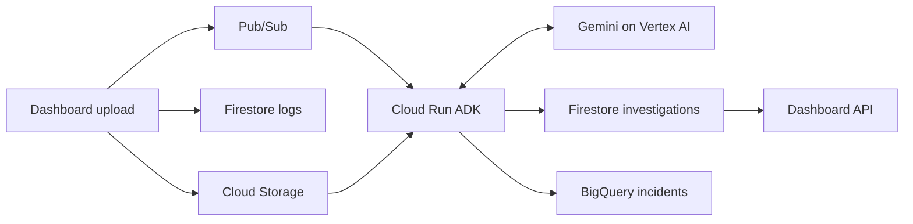

# ADK investigation service

Zein owns this service. Mahmoud owns the dashboard and its CI/CD. Branch workflow: `zein/adk` -> PR to `dev` -> PR to protected `main`.

The service receives authenticated Pub/Sub push requests, retrieves the uploaded raw log from Cloud Storage, looks up up to five related incidents from the last seven days in BigQuery, runs one ADK/Gemini investigation, persists structured findings in Firestore, and appends a summary to BigQuery using a load job. History lookup uses fixed, parameterized SQL with a 50 MiB billing cap; failure falls back to the current log alone.

The initial private deployment was verified on October 8, 2026. The current dashboard automatically queues investigations and displays their findings. Both Cloud Build pipeline files now test and scan the dashboard and agent; dev releases deploy both images after security gates pass.



## Deploy from PowerShell

Docker Desktop and an authenticated `gcloud.cmd` are required. From this directory:

```powershell
powershell.exe -ExecutionPolicy Bypass -File .\Deploy-Agent.ps1 -Tag YOUR_COMMIT_SHA
```

This builds and tests the image, pushes to the existing registry, creates the table if missing or adds nullable schema fields, grants the agent BigQuery job creation, deploys the private service, grants the push account invocation access, and configures authenticated push. It preserves the existing dead-letter and retry configuration. Provision `infra/Configure-Network.ps1` first; deployments now preserve Direct VPC egress through private Google API DNS. No Terraform, API keys or service-account key files are used. See the [network and analytics handoff](../infra/Analytics-VPC-handoff.md).

| Setting | Value |
|---|---|
| Project | `ai-log-analyzer-511017` |
| Cloud Run region | `us-central1` |
| Service | `log-analyzer-dev-agent` |
| Image | `us-central1-docker.pkg.dev/ai-log-analyzer-511017/log-analyzer-dev/adk-agent:TAG` |
| Agent identity | `log-analyzer-dev-agent@ai-log-analyzer-511017.iam.gserviceaccount.com` |
| Push identity | `log-analyzer-dev-push@ai-log-analyzer-511017.iam.gserviceaccount.com` |
| Model | `gemini-3.1-flash-lite` (configurable) |
| Vertex location | `global` (not a regional data residency guarantee) |
| Bucket | `ai-log-analyzer-511017-raw-logs-dev` |
| Firestore | `(default)`, `logs` and `investigations` collections |
| Topic | `log-analyzer-dev-investigations` |
| Subscription | `log-analyzer-dev-investigations-sub` |
| BigQuery | `ai-log-analyzer-511017.log_analyzer_dev.incidents` |

Cloud Run verifies IAM before requests reach the application. The Pub/Sub OIDC audience is the base service URL; its push endpoint appends `/pubsub`. The existing Pub/Sub service agent has token-creator access to the push identity and permissions for dead-letter forwarding.

## Dashboard integration

After raw file and metadata storage succeed, the dashboard publishes a UUID request to Pub/Sub. `investigations.py` reads results from Firestore without downloading the raw object during polling.

| Route | Behavior |
| --- | --- |
| `POST /logs` | Saves the upload and queues its investigation; returns 201 even if dispatch failed, with an explicit retry status |
| `GET /logs/{UUID}/investigation` | Returns investigation progress and safe result fields |
| `POST /logs/{UUID}/investigation` | Requests an investigation for the saved log without creating another upload |

The dashboard automatically opens the uploaded log and polls every five seconds for up to five minutes. Findings include severity, summary, possible cause, recommendations and historical context count. Existing completed, processing or queued requests are not republished by the API. Completed Pub/Sub deliveries skip another model call.

If dispatch fails, select Retry investigation. It reuses the saved UUID. Publishing and recording dispatch state are not atomic; a timeout can cause duplicate delivery, handled by the agent's lease and completion checks.

Verify the full automatic flow from this directory:

```powershell
powershell.exe -ExecutionPolicy Bypass -File .\Smoke-Test-App.ps1
```

To retry a saved log, add `-LogId UUID`. The older `Smoke-Test.ps1` directly publishes to Pub/Sub for operator recovery.

Completed Firestore documents include findings, model, completed_at, truncated, service_name, failure_category, history_count and history_available. BigQuery stores the incident summary and classification; raw content stays in Cloud Storage.
## Limits and recovery

- One instance, concurrency one, minimum zero, request-based CPU billing. This limits parallelism, not total spend. Model calls and storage can incur charges.
- Logs capped at 1 MiB; only the first 24,000 characters go to Gemini, with a truncation indicator. No tools, arbitrary code execution or model-directed cloud writes.
- A Firestore lease prevents concurrent normal deliveries for the same log. Completed deliveries skip the model and analytics. Findings are saved before analytics so analytics retries reuse them. A crash after model response but before saving findings can repeat a paid call.
- BigQuery uses deterministic job IDs to suppress retry duplicates while BigQuery retains the job. This is not a permanent exactly-once guarantee. A terminal failed load job requires operator repair and a new job ID; repeated delivery alone will not fix that failed job.
- Incidents are partitioned by completed_at, partitions expire after seven days, and the table itself does not expire. Firestore and raw logs have no automatic retention cleanup yet.
- Errors return HTTP 503 for Pub/Sub retry, then the existing DLQ after approximately five attempts. Invalid messages return 400 and also reach retry/DLQ. Health checks do not verify backend access.
- Results are AI suggestions requiring review. Avoid uploading real credentials or sensitive logs; logs are sent to the configured Google model.

References: [ADK deployment](https://google.github.io/adk-docs/deploy/cloud-run/), [model lifecycle](https://docs.cloud.google.com/vertex-ai/generative-ai/docs/learn/model-versions), [BigQuery load jobs](https://docs.cloud.google.com/bigquery/docs/loading-data-local), [Pub/Sub authenticated push](https://docs.cloud.google.com/pubsub/docs/authenticate-push-subscriptions).
