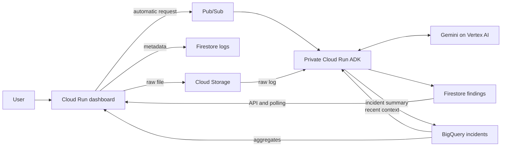

# Analytics and VPC handoff

Project `ai-log-analyzer-511017`; region `us-central1`. No Terraform.
Workflow: personal branch `zein/analytics-vpc` → PR to `dev` → reviewed PR to protected `main`.

## What the app does

`GET /analytics` reports completed AI investigations over the last seven days:
daily totals, severity, top failure categories and top services. It returns aggregates only;
raw logs and incident summaries are not returned by this endpoint.
The dashboard uses one worker with a shared 60-second query cache, including failures.
Each query has a 50 MiB billing cap and a completed_at partition filter.
These limits reduce spend; they are not a project-wide budget cap.

The agent reads up to five recent matching incidents before calling Gemini.
The fixed query excludes the current log, deduplicates historical log IDs and binds
all user-derived values as SQL parameters. The model receives that context alongside
the current log. It cannot generate SQL, invoke arbitrary tools or write cloud resources.
If history lookup fails, investigation continues without history.

New nullable BigQuery columns: `service_name` and `failure_category`.
Service detection recognizes `INFO NAME started`; category rules currently identify
database timeout, authentication and payment timeout. Other input is unclassified.
These are simple heuristics, not confirmed root causes. Existing rows remain readable.
Firestore investigation documents also record those fields, `history_count` and
`history_available`. Existing seven-day partition expiry remains unchanged.

## Data flow

The dashboard publishes automatically after durable storage, and its API exposes
queued, processing, retrying and completed status with findings. Both `/investigations/{UUID}` and `/logs/{UUID}/investigation` support status and retry. The UI polls the selected
log and displays severity, summary, possible cause, recommendations and history count.
Use `agent_service/Smoke-Test-App.ps1` to verify the automatic flow.
The analytics page counts completed investigations, not every uploaded file.

## Network

| Resource | Configuration |
| --- | --- |
| VPC | `log-analyzer-dev-vpc`, custom, regional routing |
| Subnet | `log-analyzer-dev-subnet`, `10.42.0.0/24`, `us-central1` |
| Private Google Access | Enabled on subnet |
| Cloud Run egress | Direct VPC, all traffic, both services |
| Cloud Run network tag | `log-analyzer-dev` |
| Private DNS zone | `log-analyzer-dev-googleapis`, `googleapis.com.` |
| API DNS | `*.googleapis.com.` → `private.googleapis.com.` |
| API addresses | `199.36.153.8`, `.9`, `.10`, `.11` |
| API route | `199.36.153.8/30` via default internet gateway, priority 100 |
| Egress allow | Tagged workloads, TCP 443 to API range, priority 900 |
| Egress deny | Tagged workloads, other IPv4 destinations, priority 1000 |

Google API traffic routed this way remains on Google's network. The dashboard's
public HTTPS URL remains available. The agent still requires Cloud Run Invoker IAM.
Cloud Storage, Firestore and BigQuery are managed API services, not databases placed
inside this subnet. IAM still controls their access. This is not a VPC Service Controls
perimeter. No NAT, VPC connector, VM or load balancer is provisioned.
Cloud DNS and service usage can incur charges. Direct VPC cold starts can delay egress.

Provision with `infra/Configure-Network.ps1`; add `-AttachServices` only when attaching
existing revisions without an application deployment. It creates missing resources
and updates DNS records. Existing firewall/route definitions must be checked for drift.

## IAM additions

- Dashboard: dataset READER on `log_analyzer_dev`, plus project `roles/bigquery.jobUser`.
- Agent: existing dataset WRITER and project jobUser permit the fixed history query.
- Build identity: Object Viewer on the Cloud Build source archive bucket
  `ai-log-analyzer-511017_cloudbuild` for local `builds submit` archives.
- Cloud Run service agent uses its existing `roles/run.serviceAgent` network permissions.

No service-account keys, additional human impersonation grants or project-wide
BigQuery data access are required.

## CI/CD settings for Mahmoud

`cloudbuild.yaml` now preserves Direct VPC settings and passes the BigQuery environment.
Keep the existing release service account, security gates and immutable build-ID image
tags. Both YAML files include `analytics.py` in Bandit scanning.

New trigger substitutions (resource names, not secrets):

| Variable | Value |
| --- | --- |
| `_BIGQUERY_TABLE` | `ai-log-analyzer-511017.log_analyzer_dev.incidents` |
| `_VPC_NETWORK` | `log-analyzer-dev-vpc` |
| `_VPC_SUBNET` | `log-analyzer-dev-subnet` |
| `_INVESTIGATION_TOPIC` | `log-analyzer-dev-investigations` |
| `_AGENT_SERVICE` | `log-analyzer-dev-agent` |
| `_AGENT_IMAGE` | `us-central1-docker.pkg.dev/ai-log-analyzer-511017/log-analyzer-dev/adk-agent` |
| `_AGENT_RUNTIME_SERVICE_ACCOUNT` | `log-analyzer-dev-agent@ai-log-analyzer-511017.iam.gserviceaccount.com` |
| `_GEMINI_MODEL` | `gemini-3.1-flash-lite` |

The dashboard environment also needs `BIGQUERY_LOCATION=us-central1` and
`INVESTIGATION_TOPIC=log-analyzer-dev-investigations`; both are passed by Cloud Build.
Agent deployments use `agent_service/Deploy-Agent.ps1 -Tag UNIQUE_TAG`:
it applies the additive schema, preserves VPC egress and keeps authenticated Pub/Sub push.
Both pipeline files now test, audit, build and scan the dashboard and agent independently.
The dev release deploys the private agent before the public dashboard using the same build ID.

Review these changes into `dev` before relying on the dev trigger to preserve all settings.
No production pipeline is added here.

## Initial analytics deployment: October 9, 2026

- Dashboard revision `log-analyzer-dev-00006-zhm`; anonymous dashboard and health return 200.
- Agent revision `log-analyzer-dev-agent-00003-z4c`; anonymous health returns 403.
- Both revisions have Direct VPC network/subnet/tag annotations and all-traffic egress.
- Release build `8d7ed8a1-516e-42bf-8c8a-e24a4d1b4727` succeeded through all dashboard security gates.
- Baseline regression tests: 24 dashboard tests and 10 agent tests passed. Agent Bandit and dependency audit passed. Agent image scanning was added in the subsequent full-app release.
- Synthetic investigations `6fd6822f-d6c6-4ef9-b149-78e08d81df5b` and `83b88cee-da9f-42e2-aeaf-eb5b3ba25423` each produced exactly one BigQuery row.
- The second investigation stored `history_count=1`, `history_available=true`, service `orders`, category `database_timeout`.
- Reporting returned 10 completed investigations, including those two database timeouts.
- The three new substitutions were applied and read back from the existing dev trigger.

These are deployment-time checks, not a production availability guarantee.

## Complete app release: October 9, 2026

Build `f1a12f59-080a-4f4b-ba0b-705017d1b9fd` passed tests, Bandit, pip-audit and
Trivy HIGH/CRITICAL vulnerability and secret checks for both images. It deployed
agent revision `log-analyzer-dev-agent-00004-47h`, then dashboard revision
`log-analyzer-dev-00007-nhb`. Both use the build ID as their image tag.

The regression suite now contains 33 dashboard tests and 10 agent tests. A real
browser uploaded `bcdd3a34-f2eb-4ad0-b1ac-c901dc60648c`, automatically queued it,
and displayed completed findings with two historical incidents and no JavaScript errors.
An independent API upload, `413a9b60-982f-4995-8088-81a2f0672667`, completed with
three historical incidents. Both produced one BigQuery row. Retrying the completed
browser upload reused its existing findings and completion timestamp.

The dashboard remains public; anonymous agent access still returns 403. The existing
dev trigger now has the topic, agent image/service/account and Gemini model variables.
Review the updated feature PR into dev so future automatic releases use this complete
pipeline. Production promotion into main remains a separate reviewed PR.

References: [Direct VPC egress](https://docs.cloud.google.com/run/docs/configuring/vpc-direct-vpc),
[Private Google Access](https://docs.cloud.google.com/vpc/docs/configure-private-google-access),
[BigQuery query cost controls](https://docs.cloud.google.com/bigquery/docs/best-practices-costs).
